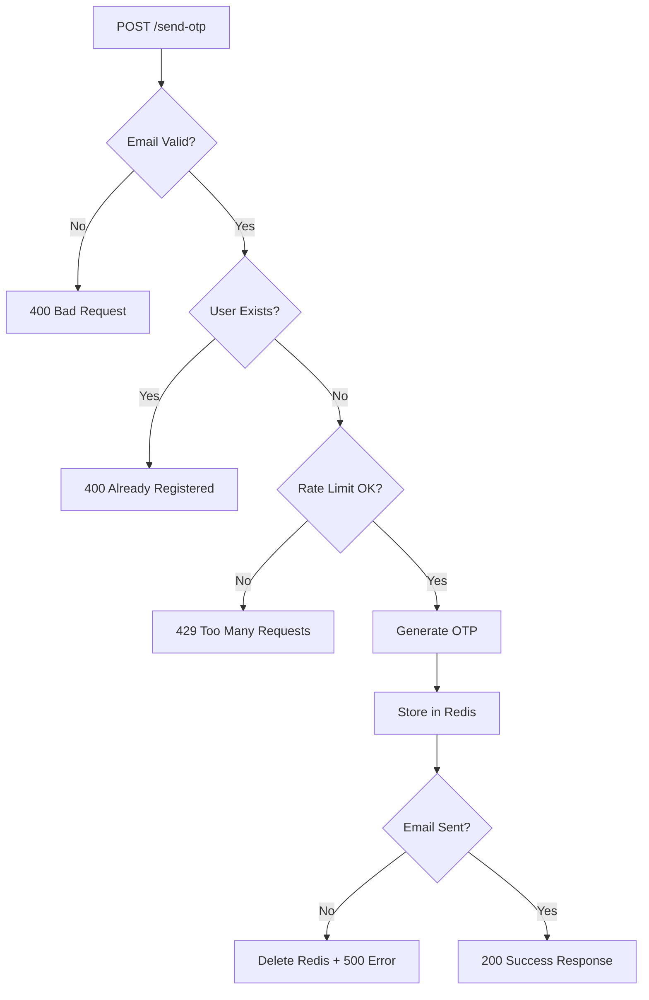

# 📧🔐 LUỒNG HOẠT ĐỘNG CHI TIẾT CỦA QUÁ TRÌNH GỬI OTP

## 🎯 Tổng quan Flow
```
Client Request → Rate Limit Check → Generate OTP → Store Redis → Send Email → Return Response
     ↓               ↓                   ↓            ↓            ↓           ↓
  POST /send-otp  Check 3/10min     Random 6-digit  TTL=5min   Gmail SMTP   Success/Fail
```

---

## 📡 **STEP 1: Client Request**

### **Endpoint:** `POST /api/auth/send-otp`

**Request:**
```http
POST http://localhost:8080/api/auth/send-otp
Content-Type: application/json

{
  "email": "user@example.com"
}
```

**Controller Entry Point:**
```java
// AuthOtpController.sendRegistrationOtp()
@PostMapping("/send-otp")
public ResponseEntity<Map<String, Object>> sendRegistrationOtp(@RequestBody SendOtpRequest request)
```

---

## ✅ **STEP 2: Input Validation**

### **2.1 Email Validation:**
```java
String email = request.getEmail();
if (email == null || email.trim().isEmpty()) {
    return ResponseEntity.badRequest().body(
        createResponse(false, "Email is required", null)
    );
}
```

### **2.2 Existing User Check:**
```java
// Check if user already exists in database
NguoiDung existingUser = nguoiDungRepository.findByEmail(email.trim());
if (existingUser != null) {
    return ResponseEntity.badRequest().body(
        createResponse(false, "Email already registered", null)
    );
}
```

**Error Response Example:**
```json
{
  "success": false,
  "message": "Email already registered"
}
```

---

## 🚦 **STEP 3: Rate Limiting Check**

### **3.1 Rate Limit Logic trong RedisOtpService:**
```java
// redisOtpService.sendOtp(email, OtpType.REGISTER)
public OtpResult sendOtp(String email, OtpType otpType) {
    // Check rate limiting
    String rateLimitKey = "otp_rate_limit:" + email;
    Object requestCountObj = redisTemplate.opsForValue().get(rateLimitKey);
    
    // Safe casting: Redis might store as Integer or Long
    Long requestCount = castToLong(requestCountObj);
    
    // Max 3 OTP requests per email per 10 minutes
    if (requestCount != null && requestCount >= MAX_OTP_REQUESTS) {
        return new OtpResult(false, 
            "Too many OTP requests. Please wait 10 minutes.", null);
    }
}
```

### **3.2 Rate Limit Configuration:**
```java
// Rate limiting: max 3 OTP requests per email per 10 minutes
private static final long RATE_LIMIT_WINDOW_MINUTES = 10;
private static final int MAX_OTP_REQUESTS = 3;
```

### **3.3 Redis Rate Limit Keys:**
```
Key Pattern: "otp_rate_limit:{email}"
Example: "otp_rate_limit:user@example.com"
Value: Request count (1, 2, 3...)
TTL: 10 minutes
```

**Rate Limit Exceeded Response:**
```json
{
  "success": false,
  "message": "Too many OTP requests. Please wait 10 minutes."
}
```

---

## 🎲 **STEP 4: Generate OTP**

### **4.1 OTP Generation Algorithm:**
```java
private String generateOtp() {
    Random random = new Random();
    int otp = 100000 + random.nextInt(900000); // 6-digit OTP
    return String.valueOf(otp);
}

// Example outputs: 123456, 789012, 456789
```

### **4.2 Generate OTP ID:**
```java
private Integer generateOtpId() {
    Random random = new Random();
    return 100000 + random.nextInt(900000); // 6-digit Integer ID
}

// OTP ID dùng để tracking, không phải OTP verification code
```

### **4.3 Create OTP Data Structure:**
```java
// Create OTP data
Map<String, Object> otpData = new HashMap<>();
otpData.put("otpId", otpId);                    // 654321 (tracking ID)
otpData.put("email", email);                    // "user@example.com"
otpData.put("otp", otp);                        // "123456" (actual OTP)
otpData.put("otpType", otpType.name());         // "REGISTER"
otpData.put("createdAt", LocalDateTime.now().format(DateTimeFormatter.ISO_LOCAL_DATE_TIME));
otpData.put("verified", false);                 // Chưa verify
otpData.put("attempts", 0);                     // Số lần thử = 0
```

---

## 💾 **STEP 5: Store in Redis**

### **5.1 Redis Key Strategy:**
```java
// Store in Redis with TTL
String otpKey = "otp:" + email + ":" + otpType.name();
// Example: "otp:user@example.com:REGISTER"

String otpDataJson = objectMapper.writeValueAsString(otpData);
redisTemplate.opsForValue().set(otpKey, otpDataJson, OTP_EXPIRATION_MINUTES, TimeUnit.MINUTES);
```

### **5.2 OTP Configuration:**
```java
// OTP expires in 5 minutes
private static final long OTP_EXPIRATION_MINUTES = 5;
```

### **5.3 Redis Storage Structure:**
```json
// Redis Key: "otp:user@example.com:REGISTER"
// TTL: 5 minutes
{
  "otpId": 654321,
  "email": "user@example.com",
  "otp": "123456",
  "otpType": "REGISTER", 
  "createdAt": "2024-12-28T10:30:00",
  "verified": false,
  "attempts": 0
}
```

### **5.4 Update Rate Limiting Counter:**
```java
// Update rate limiting
if (requestCount == null) {
    // First request - set counter to 1 with 10-minute TTL
    redisTemplate.opsForValue().set(rateLimitKey, 1L, RATE_LIMIT_WINDOW_MINUTES, TimeUnit.MINUTES);
} else {
    // Increment existing counter
    redisTemplate.opsForValue().increment(rateLimitKey);
}
```

**Redis State After Storage:**
```
Key: "otp:user@example.com:REGISTER"        Value: {OTP Data}           TTL: 5min
Key: "otp_rate_limit:user@example.com"      Value: 1                    TTL: 10min
```

---

## 📧 **STEP 6: Send Email via Gmail SMTP**

### **6.1 Email Sending Logic:**
```java
// Send email
boolean emailSent = sendOtpEmail(email, otp, otpType);

private boolean sendOtpEmail(String email, String otp, OtpType otpType) {
    try {
        String subject = getEmailSubject(otpType);
        String body = getEmailBody(otp, otpType);
        
        // EmailService.sendMessage requires 4 params: from, to, subject, text
        emailService.sendMessage("noreply@webbansach.com", email, subject, body);
        return true;
    } catch (Exception e) {
        System.err.println("Failed to send OTP email: " + e.getMessage());
        return false;
    }
}
```

### **6.2 Email Subject Generation:**
```java
private String getEmailSubject(OtpType otpType) {
    switch (otpType) {
        case REGISTER:
            return "📧 Your Registration OTP - Web Ban Sach";
        case RESET_PASSWORD:
            return "🔐 Your Password Reset OTP - Web Ban Sach";
        default:
            return "🔑 Your OTP Code - Web Ban Sach";
    }
}
```

### **6.3 Email Body Template:**
```java
private String getEmailBody(String otp, OtpType otpType) {
    String purpose = otpType == OtpType.REGISTER ? "complete your registration" : "reset your password";
    
    return String.format("""
        <div style="font-family: Arial, sans-serif; max-width: 600px; margin: 0 auto; padding: 20px; border: 1px solid #ddd; border-radius: 8px;">
            <h2 style="color: #333; text-align: center;">🔐 OTP Verification</h2>
            
            <p>Hello,</p>
            
            <p>Your OTP code to <strong>%s</strong> is:</p>
            
            <div style="text-align: center; margin: 30px 0;">
                <span style="font-size: 32px; font-weight: bold; color: #007bff; background: #f8f9fa; padding: 15px 30px; border-radius: 8px; letter-spacing: 5px;">%s</span>
            </div>
            
            <p><strong>⏰ This OTP will expire in %d minutes.</strong></p>
            
            <p style="color: #666; font-size: 14px;">
                🔒 For your security, please do not share this OTP with anyone.<br>
                💡 If you didn't request this OTP, please ignore this email.
            </p>
            
            <hr style="margin: 30px 0; border: none; border-top: 1px solid #eee;">
            
            <p style="color: #888; font-size: 12px; text-align: center;">
                This is an automated email from Web Ban Sach. Please do not reply to this email.
            </p>
        </div>
        """,
        purpose, otp, OTP_EXPIRATION_MINUTES
    );
}
```

### **6.4 Email Configuration (application.properties):**
```properties
# Gmail SMTP Configuration
spring.mail.host=smtp.gmail.com
spring.mail.port=587
spring.mail.username=your-email@gmail.com
spring.mail.password=your-app-password
spring.mail.properties.mail.smtp.auth=true
spring.mail.properties.mail.smtp.starttls.enable=true
```

### **6.5 Email Sample Output:**
```html
📧 Your Registration OTP - Web Ban Sach

Hello,
Your OTP code to complete your registration is:

    123456

⏰ This OTP will expire in 5 minutes.

🔒 For your security, please do not share this OTP with anyone.
💡 If you didn't request this OTP, please ignore this email.
```

---

## 🎯 **STEP 7: Response Handling**

### **7.1 Success Response:**
```java
if (emailSent) {
    System.out.println("✅ OTP sent successfully to " + email + " and stored in Redis with " + OTP_EXPIRATION_MINUTES + " min TTL");
    return new OtpResult(true, "OTP sent successfully", otpId);
} else {
    // Remove from Redis if email failed
    redisTemplate.delete(otpKey);
    return new OtpResult(false, "Failed to send OTP email", null);
}
```

### **7.2 Controller Success Response:**
```java
if (result.isSuccess()) {
    return ResponseEntity.ok(createResponse(true, "OTP sent to your email", 
        Map.of("otpId", result.getOtpId(), "email", email.trim())));
} else {
    return ResponseEntity.badRequest().body(createResponse(false, result.getMessage(), null));
}
```

**Success Response JSON:**
```json
{
  "success": true,
  "message": "OTP sent to your email",
  "data": {
    "otpId": 654321,
    "email": "user@example.com"
  }
}
```

### **7.3 Error Handling:**
```java
} catch (Exception e) {
    System.err.println("Error in sendRegistrationOtp: " + e.getMessage());
    e.printStackTrace();
    return ResponseEntity.internalServerError()
        .body(createResponse(false, "Failed to send OTP: " + e.getMessage(), null));
}
```

**Error Response JSON:**
```json
{
  "success": false,
  "message": "Failed to send OTP: SMTP connection failed"
}
```

---

## 🔄 **STEP 8: Cleanup on Email Failure**

### **8.1 Rollback Logic:**
```java
if (emailSent) {
    // Email successful - keep OTP in Redis
    return new OtpResult(true, "OTP sent successfully", otpId);
} else {
    // Email failed - clean up Redis to avoid orphan data
    redisTemplate.delete(otpKey);
    return new OtpResult(false, "Failed to send OTP email", null);
}
```

### **8.2 Rate Limit Consideration:**
```java
// Note: Rate limit counter is NOT rolled back on email failure
// This prevents abuse by repeatedly triggering email failures
```

---

## 🔍 **Monitoring & Debugging**

### **8.1 OTP Statistics Endpoint:**
```java
@PostMapping("/otp-stats")
public ResponseEntity<Map<String, Object>> getOtpStats(@RequestBody Map<String, String> request) {
    String email = request.get("email");
    Map<String, Object> stats = redisOtpService.getOtpStats(email.trim(), OtpType.REGISTER);
    return ResponseEntity.ok(createResponse(true, "OTP statistics retrieved from Redis", stats));
}
```

**Stats Response:**
```json
{
  "success": true,
  "message": "OTP statistics retrieved from Redis",
  "data": {
    "otpExists": true,
    "otpTTL": 298,
    "requestCount": 2,
    "rateLimitTTL": 567
  }
}
```

### **8.2 Console Logging:**
```java
// Success logging (without exposing OTP value)
System.out.println("✅ OTP sent successfully to " + email + " and stored in Redis with " + OTP_EXPIRATION_MINUTES + " min TTL");

// Error logging
System.err.println("Failed to send OTP email: " + e.getMessage());
```

---

## ⚠️ **Security Features**

### **✅ Rate Limiting:**
- Max 3 OTP requests per email per 10 minutes
- Prevents spam and abuse

### **✅ Auto Expiration:**
- OTP automatically expires after 5 minutes
- No manual cleanup needed

### **✅ Secure Storage:**
- Plain OTP stored in Redis (encrypted in production)
- Temporary storage with TTL

### **✅ Email Verification:**
- OTP sent to actual email address
- Confirms email ownership

### **✅ Error Handling:**
- Graceful degradation on failures
- No sensitive data in error messages

### **✅ Idempotency:**
- Multiple requests overwrite previous OTP
- Only latest OTP is valid

---

## 🔧 **Configuration Constants**

```java
// RedisOtpService Configuration
private static final long OTP_EXPIRATION_MINUTES = 5;          // OTP TTL
private static final long RATE_LIMIT_WINDOW_MINUTES = 10;      // Rate limit window
private static final int MAX_OTP_REQUESTS = 3;                 // Max requests per window

// Redis Key Patterns
"otp:{email}:{otpType}"                    // OTP storage key
"otp_rate_limit:{email}"                   // Rate limit counter key
```

---

## 🧪 **Testing Flow**

### **Test Cases:**
1. ✅ **Valid email** → OTP sent successfully
2. ✅ **Empty email** → Validation error
3. ✅ **Existing user email** → Already registered error
4. ✅ **Rate limit exceeded** → Too many requests error
5. ✅ **SMTP failure** → Email sending error
6. ✅ **Multiple requests** → Latest OTP overwrites old

### **Test with Postman:**
```bash
# Test 1: Send OTP
POST http://localhost:8080/api/auth/send-otp
{
  "email": "test@example.com"
}

# Test 2: Check stats
POST http://localhost:8080/api/auth/otp-stats  
{
  "email": "test@example.com"
}

# Test 3: Rate limiting (send 4 times rapidly)
# 4th request should return rate limit error
```

---

## 📊 **Flow Summary**



**Thành công**: Client nhận được OTP qua email và có thể tiến hành verify để hoàn tất đăng ký! 🎉