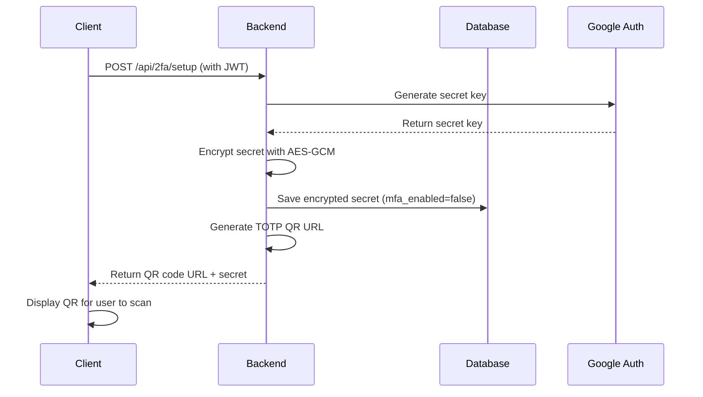
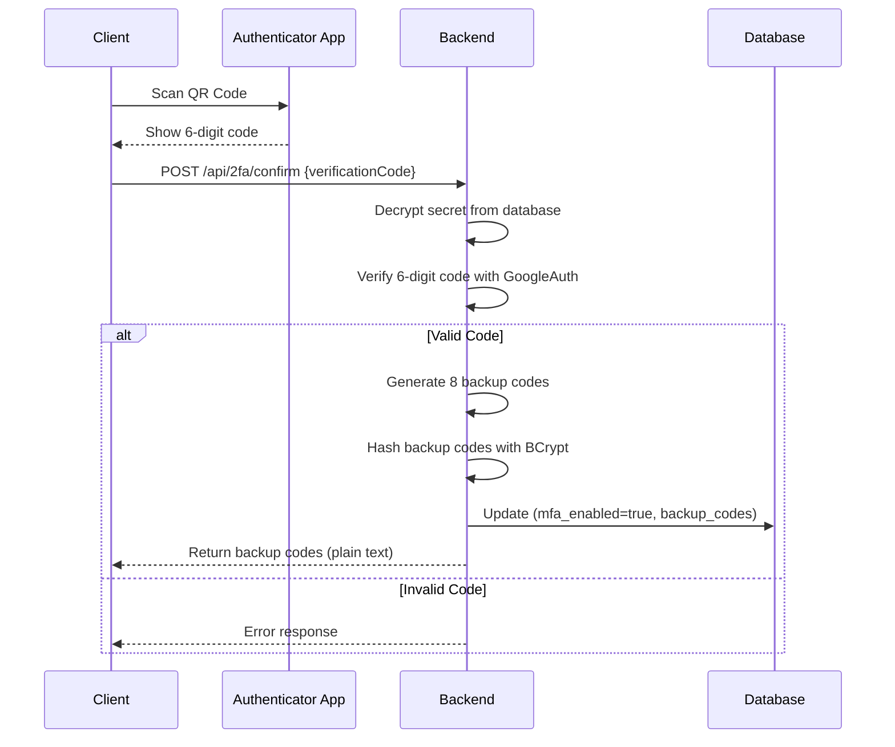
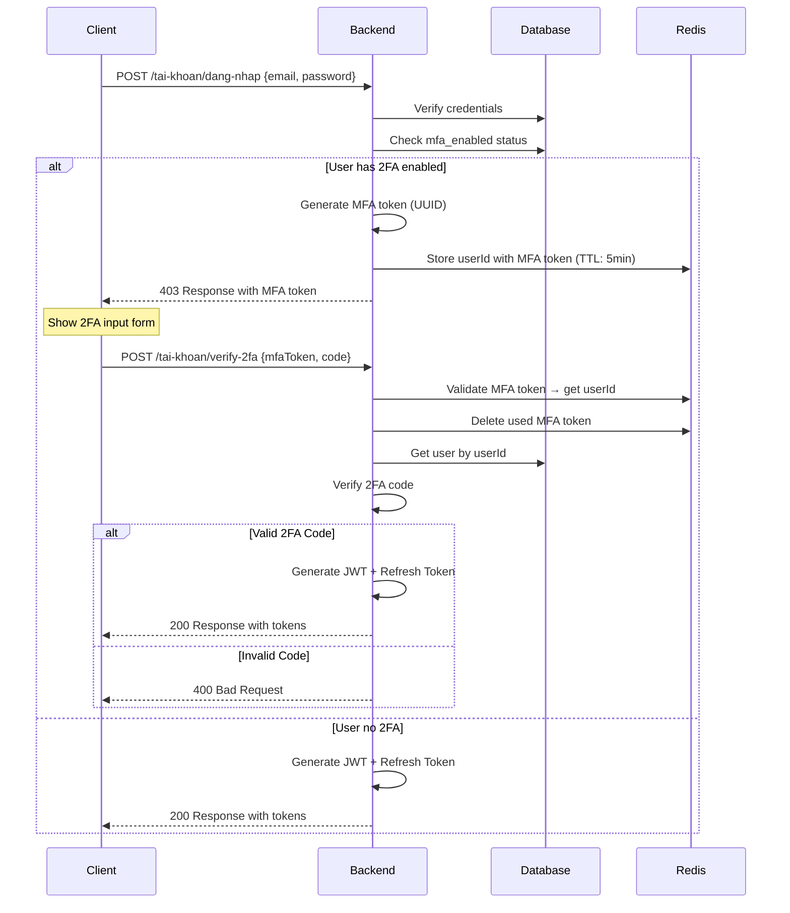
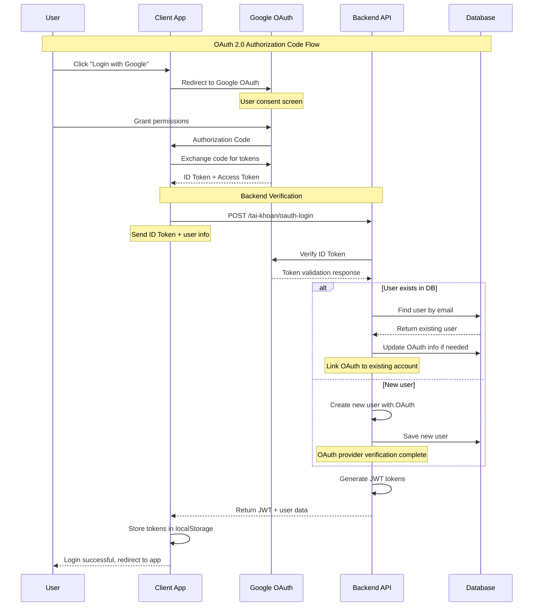
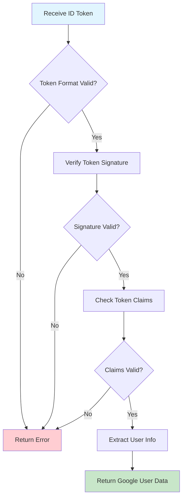
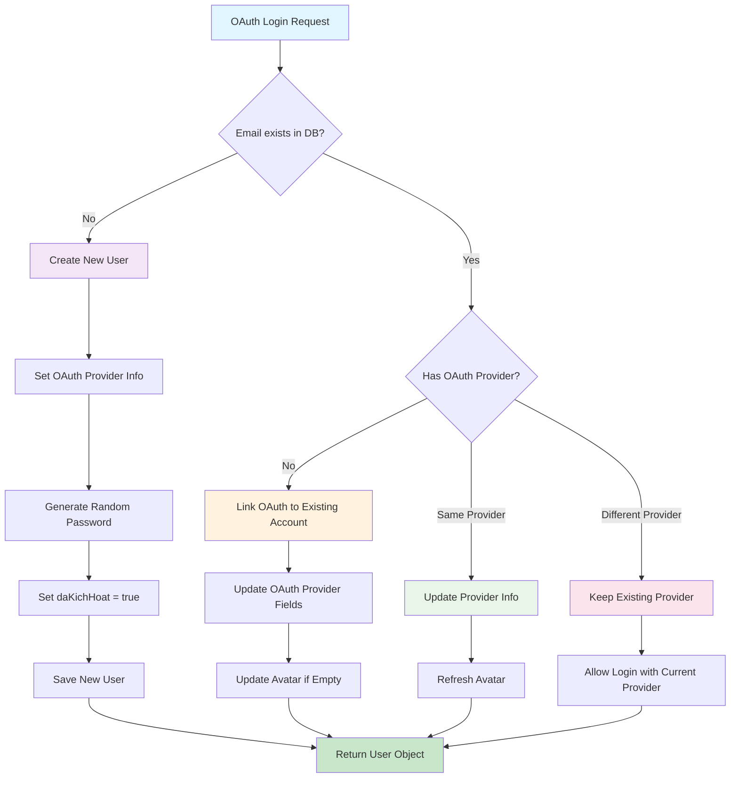
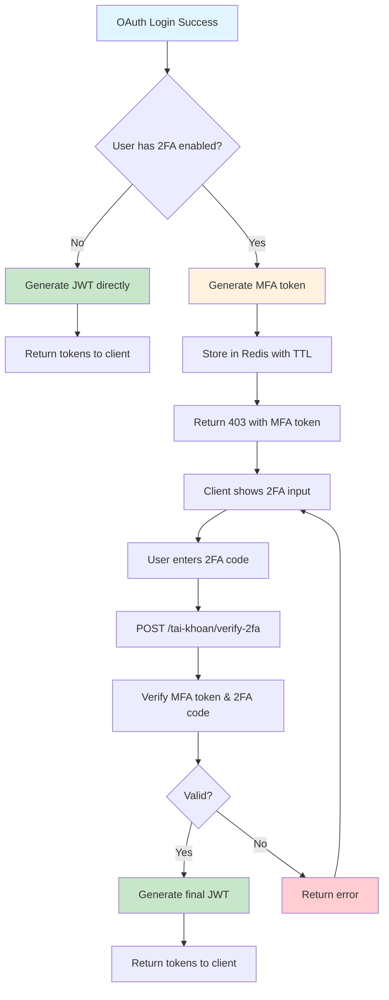

# Tóm Tắt Quy Trình Hoạt Động 2FA (Two-Factor Authentication)

## 📋 Tổng Quan Hệ Thống

Hệ thống 2FA được triển khai theo chuẩn **TOTP (Time-based One-Time Password)** sử dụng **Google Authenticator** hoặc các app authenticator tương tự. Hệ thống hoạt động trong 2 giai đoạn chính:

1. **🛠️ Thiết lập 2FA** - Người dùng kích hoạt bảo mật 2 lớp lần đầu
2. **🔐 Đăng nhập với 2FA** - Xác thực mã 2FA mỗi lần đăng nhập

---

## 🏗️ Kiến Trúc Hệ Thống

### Core Components

```
┌─────────────────────┐    ┌─────────────────────┐    ┌─────────────────────┐
│   Client Frontend   │    │   Spring Backend    │    │      Database       │
├─────────────────────┤    ├─────────────────────┤    ├─────────────────────┤
│ • Setup UI          │◄──►│ • TwoFactorAuth     │    │ • nguoi_dung        │
│ • QR Code Scanner   │    │   Controller        │    │   - mfa_enabled     │
│ • Login Flow        │    │ • TwoFactorAuth     │◄──►│   - mfa_secret      │
│ • Authenticator App │    │   Service           │    │   - backup_codes    │
└─────────────────────┘    └─────────────────────┘    └─────────────────────┘
                                       │
                           ┌─────────────────────┐
                           │       Redis         │
                           ├─────────────────────┤
                           │ • MFA Tokens        │
                           │ • TTL: 5 minutes    │
                           └─────────────────────┘
```

### 🔐 Security Features

```java
// Encryption cho MFA Secrets
private static final String ALGORITHM = "AES";
private static final String TRANSFORMATION = "AES/GCM/NoPadding";

// Key management
@Value("${app.chat.encryption.key:#{null}}")
private String encryptionKeyBase64;

// Backup codes hashing
@Autowired
private PasswordEncoder passwordEncoder; // BCrypt
```

---

## 🛠️ Giai Đoạn 1: Thiết Lập 2FA

### 1.1 Tạo QR Code



#### Backend Implementation

```java
public String generateQrCodeUrl(NguoiDung nguoiDung) {
    // 1. Tạo secret key mới
    GoogleAuthenticatorKey key = googleAuthenticator.createCredentials();
    String secretKey = key.getKey();
    
    // 2. Mã hóa secret key trước khi lưu vào database
    String encryptedSecret = messageEncryptionUtil.encrypt(secretKey);
    
    // 3. Lưu encrypted secret key vào database
    nguoiDung.setMfaSecret(encryptedSecret);
    nguoiDung.setMfaEnabled(false); // Chưa kích hoạt chính thức
    nguoiDungRepository.save(nguoiDung);
    
    // 4. Tạo QR Code URL với secret key gốc (chưa mã hóa)
    String qrCodeUrl = generateTotpUrl(nguoiDung.getEmail(), secretKey);
    
    return qrCodeUrl;
}

private String generateTotpUrl(String email, String secretKey) {
    return String.format(
        "otpauth://totp/%s:%s?secret=%s&issuer=%s",
        URLEncoder.encode(APP_NAME, "UTF-8"),
        URLEncoder.encode(email, "UTF-8"),
        secretKey,
        URLEncoder.encode(APP_NAME, "UTF-8")
    );
}
```

### 1.2 Xác Nhận Thiết Lập



#### Backend Implementation

```java
public List<String> confirmTwoFactorSetup(NguoiDung nguoiDung, String verificationCode) {
    if (nguoiDung.getMfaSecret() == null) {
        return null;
    }
    
    try {
        // 1. Giải mã secret key để verify
        String decryptedSecret = messageEncryptionUtil.decrypt(nguoiDung.getMfaSecret());
        
        // 2. Verify mã 6 số
        int code = Integer.parseInt(verificationCode.trim());
        boolean isValidCode = googleAuthenticator.authorize(decryptedSecret, code);
        
        if (isValidCode) {
            // 3. Kích hoạt 2FA chính thức
            nguoiDung.setMfaEnabled(true);
            
            // 4. Tạo backup codes và hash chúng
            List<String> backupCodes = generateBackupCodes(); // 8 mã 8 số
            List<String> hashedBackupCodes = new ArrayList<>();
            for (String backupCode : backupCodes) {
                hashedBackupCodes.add(passwordEncoder.encode(backupCode));
            }
            
            // 5. Lưu hashed backup codes vào database
            nguoiDung.setBackupCodes(objectMapper.writeValueAsString(hashedBackupCodes));
            nguoiDungRepository.save(nguoiDung);
            
            // 6. Trả về backup codes gốc để user lưu lại
            return backupCodes;
        }
    } catch (Exception e) {
        throw new RuntimeException("Error confirming 2FA setup", e);
    }
    
    return null;
}
```

---

## 🔐 Giai Đoạn 2: Đăng Nhập Với 2FA

### 2.1 Login Flow với 2FA



### 2.2 MFA Token Management

```java
public String generateMfaToken(int userId) {
    String mfaToken = generateRandomToken(); // UUID
    String key = MFA_TOKEN_PREFIX + mfaToken;
    
    // Lưu userId vào Redis với TTL 5 phút
    redisTemplate.opsForValue().set(key, userId, MFA_TOKEN_EXPIRATION_MINUTES, TimeUnit.MINUTES);
    
    return mfaToken;
}

public Optional<Integer> validateMfaToken(String mfaToken) {
    String key = MFA_TOKEN_PREFIX + mfaToken;
    Object userIdObj = redisTemplate.opsForValue().get(key);
    
    if (userIdObj != null) {
        // Xóa token sau khi sử dụng (one-time use)
        redisTemplate.delete(key);
        return Optional.of((Integer) userIdObj);
    }
    
    return Optional.empty();
}
```

### 2.3 2FA Code Verification

```java
public boolean verifyTwoFactorCode(NguoiDung nguoiDung, String verificationCode) {
    if (!nguoiDung.isMfaEnabled() || nguoiDung.getMfaSecret() == null) {
        return false;
    }
    
    try {
        // 1. Giải mã secret key để verify
        String decryptedSecret = messageEncryptionUtil.decrypt(nguoiDung.getMfaSecret());
        
        // 2. Kiểm tra mã từ Authenticator app (6 số)
        int code = Integer.parseInt(verificationCode.trim());
        boolean isValidCode = googleAuthenticator.authorize(decryptedSecret, code);
        
        if (isValidCode) {
            return true;
        }
    } catch (NumberFormatException e) {
        // Không phải số → có thể là backup code
    }
    
    // 3. Kiểm tra backup codes nếu mã Authenticator không đúng
    return verifyBackupCode(nguoiDung, verificationCode);
}
```

### 2.4 Backup Code Verification

```java
private boolean verifyBackupCode(NguoiDung nguoiDung, String inputCode) {
    if (nguoiDung.getBackupCodes() == null) {
        return false;
    }
    
    try {
        // 1. Parse backup codes từ JSON
        List<String> hashedBackupCodes = objectMapper.readValue(
            nguoiDung.getBackupCodes(), 
            new TypeReference<List<String>>() {}
        );
        
        // 2. Check input code với từng backup code
        for (String hashedCode : hashedBackupCodes) {
            if (passwordEncoder.matches(inputCode, hashedCode)) {
                // 3. Remove used backup code
                hashedBackupCodes.remove(hashedCode);
                nguoiDung.setBackupCodes(objectMapper.writeValueAsString(hashedBackupCodes));
                nguoiDungRepository.save(nguoiDung);
                
                return true;
            }
        }
    } catch (Exception e) {
        return false;
    }
    
    return false;
}
```

---

## 🗄️ Database Schema

### Nguoi_Dung Table Structure

```sql
ALTER TABLE nguoi_dung 
ADD COLUMN mfa_enabled BOOLEAN DEFAULT FALSE NOT NULL,
ADD COLUMN mfa_secret VARCHAR(500) NULL,  -- Encrypted AES-GCM data
ADD COLUMN backup_codes TEXT NULL;        -- JSON array of hashed codes

-- Indexes for performance
CREATE INDEX idx_nguoi_dung_mfa_enabled ON nguoi_dung(mfa_enabled);
```

### Data Examples

```javascript
// User với 2FA enabled
{
  "maNguoiDung": 123,
  "email": "user@email.com",
  "mfaEnabled": true,
  "mfaSecret": "j8fk2Jd9xLm3pQ7W8nRs1vBcH4yT6gE9...", // AES encrypted
  "backupCodes": "[\"$2a$10$hash1...\", \"$2a$10$hash2...\", ...]" // BCrypt hashed
}

// Redis MFA Token
{
  "key": "mfa_token:uuid-1234-5678-9abc",
  "value": 123,           // userId
  "ttl": 300             // 5 minutes
}
```

---

## 🔄 Complete API Flow

### Setup Phase APIs

```bash
# Step 1: Generate QR Code
POST /api/2fa/setup
Authorization: Bearer <jwt_token>

Response:
{
  "success": true,
  "message": "QR code generated",
  "data": {
    "success": true,
    "message": "Scan QR code with your authenticator app",
    "qrCodeUrl": "otpauth://totp/WebBanSach:user@email.com?secret=ABC123SECRET&issuer=WebBanSach",
    "secretKey": "ABC123SECRET"
  }
}

# Step 2: Confirm Setup
POST /api/2fa/confirm
Authorization: Bearer <jwt_token>
Content-Type: application/json

{
  "verificationCode": "123456"  // 6-digit from authenticator
}

Response:
{
  "success": true,
  "message": "2FA enabled successfully",
  "data": {
    "success": true,
    "message": "2FA enabled successfully",
    "backupCodes": [
      "12345678", "87654321", "11223344", "55667788",
      "99887766", "44332211", "66778899", "33445566"
    ]
  }
}
```

### Login Phase APIs

```bash
# Step 1: Normal Login
POST /tai-khoan/dang-nhap
Content-Type: application/json

{
  "username": "user@email.com",
  "password": "password123"
}

# Response if user has 2FA
HTTP 403 Forbidden
{
  "success": false,
  "message": "Two-factor authentication required",
  "mfaToken": "temp_mfa_token_here",
  "errorCode": "MFA_REQUIRED",
  "expiresIn": 300
}

# Step 2: Verify 2FA
POST /tai-khoan/verify-2fa
Content-Type: application/json

{
  "mfaToken": "temp_mfa_token_here",
  "verificationCode": "123456"  // 6-digit OR 8-digit backup code
}

# Success Response
HTTP 200 OK
{
  "jwt": "actual_jwt_token",
  "refreshToken": "refresh_token",
  "id": 1,
  "email": "user@email.com",
  "admin": false,
  "seller": true,
  "tenGianHang": "My Shop"
}
```

### Management APIs

```bash
# Check 2FA Status
GET /api/2fa/status
Authorization: Bearer <jwt_token>

# Disable 2FA
POST /api/2fa/disable
Authorization: Bearer <jwt_token>
{
  "verificationCode": "123456"
}

# Regenerate Backup Codes
POST /api/2fa/regenerate-backup-codes
Authorization: Bearer <jwt_token>
{
  "verificationCode": "123456"
}
```

---

## 💻 Frontend Integration Guide

### 1. Setup 2FA Flow

```javascript
// Step 1: Generate QR Code
async function setup2FA() {
    const response = await fetch('/api/2fa/setup', {
        method: 'POST',
        headers: {
            'Authorization': `Bearer ${localStorage.getItem('token')}`,
            'Content-Type': 'application/json'
        }
    });
    
    if (response.ok) {
        const data = await response.json();
        const qrCodeUrl = data.data.qrCodeUrl;
        
        // Display QR code for user to scan
        displayQRCode(qrCodeUrl);
        
        // Show secret key as backup
        document.getElementById('secretKey').textContent = data.data.secretKey;
    }
}

// Step 2: Confirm setup with verification code
async function confirm2FA(verificationCode) {
    const response = await fetch('/api/2fa/confirm', {
        method: 'POST',
        headers: {
            'Authorization': `Bearer ${localStorage.getItem('token')}`,
            'Content-Type': 'application/json'
        },
        body: JSON.stringify({
            verificationCode: verificationCode
        })
    });
    
    if (response.ok) {
        const data = await response.json();
        const backupCodes = data.data.backupCodes;
        
        // Show backup codes for user to save
        displayBackupCodes(backupCodes);
        alert('2FA enabled successfully! Please save your backup codes.');
    }
}
```

### 2. Login with 2FA Flow

```javascript
async function login(email, password) {
    // Step 1: Normal login
    const loginResponse = await fetch('/tai-khoan/dang-nhap', {
        method: 'POST',
        headers: { 'Content-Type': 'application/json' },
        body: JSON.stringify({ username: email, password: password })
    });
    
    if (loginResponse.status === 403) {
        // User has 2FA enabled
        const mfaData = await loginResponse.json();
        const mfaToken = mfaData.mfaToken;
        
        // Show 2FA input form
        show2FAForm(mfaToken);
        
    } else if (loginResponse.ok) {
        // User doesn't have 2FA
        const userData = await loginResponse.json();
        storeTokens(userData.jwt, userData.refreshToken);
        redirectToApp();
    } else {
        showError('Invalid credentials');
    }
}

async function verify2FA(mfaToken, verificationCode) {
    // Step 2: Verify 2FA code
    const response = await fetch('/tai-khoan/verify-2fa', {
        method: 'POST',
        headers: { 'Content-Type': 'application/json' },
        body: JSON.stringify({
            mfaToken: mfaToken,
            verificationCode: verificationCode
        })
    });
    
    if (response.ok) {
        const userData = await response.json();
        storeTokens(userData.jwt, userData.refreshToken);
        redirectToApp();
    } else {
        const error = await response.json();
        showError(error.message || 'Invalid verification code');
    }
}

function storeTokens(jwt, refreshToken) {
    localStorage.setItem('token', jwt);
    localStorage.setItem('refreshToken', refreshToken);
}
```

### 3. QR Code Generation

```javascript
// Using qrcode.js library
function displayQRCode(qrCodeUrl) {
    const canvas = document.getElementById('qrcode');
    QRCode.toCanvas(canvas, qrCodeUrl, {
        width: 200,
        margin: 2,
        color: {
            dark: '#000000',
            light: '#FFFFFF'
        }
    });
}

// Alternative: Using qrcode-generator
function generateQRCode(qrCodeUrl) {
    const qr = qrcode(0, 'M');
    qr.addData(qrCodeUrl);
    qr.make();
    document.getElementById('qrcode').innerHTML = qr.createImgTag(4);
}
```

---

## 🔒 Bảo Mật Chi Tiết

### 1. MFA Secret Encryption

```java
// MFA secrets được mã hóa AES-256-GCM
// Tái sử dụng MessageEncryptionUtil từ chat system

@Component
public class TwoFactorAuthService {
    @Autowired
    private MessageEncryptionUtil messageEncryptionUtil;
    
    // Encrypt before saving
    String encryptedSecret = messageEncryptionUtil.encrypt(secretKey);
    
    // Decrypt before using
    String decryptedSecret = messageEncryptionUtil.decrypt(nguoiDung.getMfaSecret());
}
```

### 2. Backup Code Security

```java
// Backup codes được hash bằng BCrypt
@Autowired
private PasswordEncoder passwordEncoder; // BCrypt

// Generate và hash backup codes
List<String> backupCodes = generateBackupCodes(); // Plain text
List<String> hashedBackupCodes = new ArrayList<>();
for (String backupCode : backupCodes) {
    hashedBackupCodes.add(passwordEncoder.encode(backupCode)); // Hash with BCrypt
}

// Verify backup code
boolean matches = passwordEncoder.matches(inputCode, hashedCode);
```

### 3. MFA Token Security

```java
// MFA tokens có tính năng:
// - One-time use (xóa sau khi verify)
// - TTL 5 phút
// - Stored in Redis (temporary)
// - UUID format để tránh guessing

private static final long MFA_TOKEN_EXPIRATION_MINUTES = 5;

public String generateMfaToken(int userId) {
    String mfaToken = UUID.randomUUID().toString();
    String key = MFA_TOKEN_PREFIX + mfaToken;
    
    redisTemplate.opsForValue().set(key, userId, MFA_TOKEN_EXPIRATION_MINUTES, TimeUnit.MINUTES);
    return mfaToken;
}
```

### 4. Time Synchronization

```java
// Google Authenticator sử dụng time-based codes
// Server time phải sync với client time
// Default window: 30 giây
// Google Auth library tự động handle time skew

GoogleAuthenticatorConfig config = new GoogleAuthenticatorConfig.GoogleAuthenticatorConfigBuilder()
    .setTimeStepSizeInMillis(TimeUnit.SECONDS.toMillis(30))
    .setWindowSize(1) // Allow 1 time step before/after current
    .build();
```

---

## 🧪 Testing Guide

### 1. Manual Testing Steps

```bash
# Setup Phase Testing
1. Login để lấy JWT token
2. Call POST /api/2fa/setup với token
3. Scan QR code bằng Google Authenticator/Authy
4. Call POST /api/2fa/confirm với 6-digit code
5. Lưu backup codes được return

# Login Phase Testing  
6. Logout và login lại
7. Verify 403 response với MFA token
8. Call POST /tai-khoan/verify-2fa với mã từ authenticator
9. Verify JWT được return thành công

# Backup Code Testing
10. Login lại và dùng 8-digit backup code thay vì 6-digit
11. Verify backup code chỉ dùng được 1 lần
```

### 2. Automated Testing

```java
@Test
public void testTwoFactorSetupFlow() {
    // 1. Generate QR code
    String qrCodeUrl = twoFactorAuthService.generateQrCodeUrl(testUser);
    assertNotNull(qrCodeUrl);
    assertTrue(qrCodeUrl.startsWith("otpauth://totp/"));
    
    // 2. Simulate authenticator code
    String secret = extractSecretFromQrCode(qrCodeUrl);
    int code = new GoogleAuthenticator().getTotpPassword(secret);
    
    // 3. Confirm setup
    List<String> backupCodes = twoFactorAuthService.confirmTwoFactorSetup(testUser, String.valueOf(code));
    assertNotNull(backupCodes);
    assertEquals(8, backupCodes.size());
    
    // 4. Verify user is now MFA enabled
    NguoiDung updatedUser = nguoiDungRepository.findById(testUser.getMaNguoiDung()).get();
    assertTrue(updatedUser.isMfaEnabled());
}

@Test 
public void testMfaLogin() {
    // Setup user with 2FA enabled
    setupUserWith2FA(testUser);
    
    // 1. Generate MFA token
    String mfaToken = twoFactorAuthService.generateMfaToken(testUser.getMaNguoiDung());
    assertNotNull(mfaToken);
    
    // 2. Verify valid code
    String secret = decryptSecret(testUser.getMfaSecret());
    int validCode = new GoogleAuthenticator().getTotpPassword(secret);
    boolean result = twoFactorAuthService.verifyTwoFactorCode(testUser, String.valueOf(validCode));
    assertTrue(result);
    
    // 3. Verify invalid code
    boolean invalidResult = twoFactorAuthService.verifyTwoFactorCode(testUser, "000000");
    assertFalse(invalidResult);
}
```

### 3. Postman Testing Collection

```json
{
  "info": {
    "name": "2FA Testing"
  },
  "item": [
    {
      "name": "1. Login to get JWT",
      "request": {
        "method": "POST",
        "url": "{{base_url}}/tai-khoan/dang-nhap",
        "body": {
          "mode": "raw",
          "raw": "{\"username\": \"test@email.com\", \"password\": \"password\"}"
        }
      }
    },
    {
      "name": "2. Setup 2FA",
      "request": {
        "method": "POST", 
        "url": "{{base_url}}/api/2fa/setup",
        "header": [
          {
            "key": "Authorization",
            "value": "Bearer {{jwt_token}}"
          }
        ]
      }
    },
    {
      "name": "3. Confirm 2FA",
      "request": {
        "method": "POST",
        "url": "{{base_url}}/api/2fa/confirm",
        "header": [
          {
            "key": "Authorization", 
            "value": "Bearer {{jwt_token}}"
          }
        ],
        "body": {
          "mode": "raw",
          "raw": "{\"verificationCode\": \"123456\"}"
        }
      }
    }
  ]
}
```

---

## 🐛 Troubleshooting

### Common Issues

| Error | Cause | Solution |
|-------|--------|----------|
| `JpaSystemException: Null value assigned to primitive type` | Database có NULL trong `mfa_enabled` | Chạy migration SQL fix NULL values |
| `401 Unauthorized` trên `/api/2fa/setup` | JWT token invalid hoặc missing | Kiểm tra Authorization header format |
| `401 Unauthorized` trên `/tai-khoan/verify-2fa` | Endpoint cần permit trong SecurityConfig | Thêm `.requestMatchers("/tai-khoan/verify-2fa").permitAll()` |
| `Invalid verification code` | Time sync issue | Kiểm tra đồng hồ hệ thống, thử backup code |
| `MFA token invalid or expired` | Token đã hết hạn hoặc sử dụng rồi | Đăng nhập lại từ đầu |

### Database Migration Issues

```sql
-- Check current state
SELECT mfa_enabled, COUNT(*) FROM nguoi_dung GROUP BY mfa_enabled;

-- Fix NULL values  
UPDATE nguoi_dung SET mfa_enabled = FALSE WHERE mfa_enabled IS NULL;

-- Ensure NOT NULL constraint
ALTER TABLE nguoi_dung MODIFY COLUMN mfa_enabled BOOLEAN DEFAULT FALSE NOT NULL;

-- Verify fix
SELECT COUNT(*) FROM nguoi_dung WHERE mfa_enabled IS NULL; -- Should be 0
```

### Code Verification Issues

```java
// Time synchronization check
@Component
public class TimeCheckService {
    public boolean checkTimeSync() {
        long currentTime = System.currentTimeMillis() / 1000;
        long googleTime = getCurrentTimeFromGoogle(); // Implement HTTP call
        long diff = Math.abs(currentTime - googleTime);
        
        return diff < 30; // Allow 30 second difference
    }
}

// Manual code generation for testing
public String generateManualCode(String secret) {
    GoogleAuthenticator gAuth = new GoogleAuthenticator();
    long timeIndex = System.currentTimeMillis() / 1000 / 30;
    return String.format("%06d", gAuth.getTotpPassword(secret, timeIndex));
}
```

---

## 📚 Dependencies & Libraries

### Maven Dependencies

```xml
<!-- Google Authenticator -->
<dependency>
    <groupId>com.warrenstrange</groupId>
    <artifactId>googleauth</artifactId>
    <version>1.5.0</version>
</dependency>

<!-- QR Code Generation -->
<dependency>
    <groupId>com.google.zxing</groupId>
    <artifactId>core</artifactId>
    <version>3.5.1</version>
</dependency>
<dependency>
    <groupId>com.google.zxing</groupId>
    <artifactId>javase</artifactId>
    <version>3.5.1</version>
</dependency>

<!-- Spring Security for BCrypt -->
<dependency>
    <groupId>org.springframework.boot</groupId>
    <artifactId>spring-boot-starter-security</artifactId>
</dependency>

<!-- Redis for MFA tokens -->
<dependency>
    <groupId>org.springframework.boot</groupId>
    <artifactId>spring-boot-starter-data-redis</artifactId>
</dependency>
```

### Configuration Classes

```java
@Configuration
public class TwoFactorAuthConfig {
    
    @Bean
    public GoogleAuthenticator googleAuthenticator() {
        GoogleAuthenticatorConfig config = new GoogleAuthenticatorConfig.GoogleAuthenticatorConfigBuilder()
            .setTimeStepSizeInMillis(TimeUnit.SECONDS.toMillis(30))
            .setWindowSize(1)
            .setCodeDigits(6)
            .setKeyRepresentation(KeyRepresentation.BASE32)
            .build();
        
        GoogleAuthenticator gAuth = new GoogleAuthenticator(config);
        return gAuth;
    }
    
    @Bean
    public PasswordEncoder passwordEncoder() {
        return new BCryptPasswordEncoder(12); // Strong BCrypt rounds
    }
}
```

---

## 📊 Monitoring & Analytics

### Key Metrics to Track

```java
@Component
public class TwoFactorMetrics {
    
    private final MeterRegistry meterRegistry;
    
    // Setup success rate
    public void recordSetupAttempt(boolean success) {
        Counter.builder("2fa.setup.attempts")
            .tag("success", String.valueOf(success))
            .register(meterRegistry)
            .increment();
    }
    
    // Login verification metrics
    public void recordVerificationAttempt(boolean success, String method) {
        Counter.builder("2fa.verification.attempts")
            .tag("success", String.valueOf(success))
            .tag("method", method) // "authenticator" or "backup_code"
            .register(meterRegistry)
            .increment();
    }
    
    // MFA token usage
    public void recordMfaTokenUsage() {
        Counter.builder("2fa.mfa_token.usage")
            .register(meterRegistry)
            .increment();
    }
}
```

### Health Checks

```java
@Component
public class TwoFactorHealthIndicator implements HealthIndicator {
    
    @Override
    public Health health() {
        try {
            // Test Google Authenticator
            GoogleAuthenticatorKey testKey = googleAuthenticator.createCredentials();
            int code = googleAuthenticator.getTotpPassword(testKey.getKey());
            boolean isValid = googleAuthenticator.authorize(testKey.getKey(), code);
            
            if (isValid) {
                return Health.up()
                    .withDetail("google_authenticator", "working")
                    .withDetail("redis_connection", checkRedisConnection())
                    .build();
            } else {
                return Health.down()
                    .withDetail("google_authenticator", "failed")
                    .build();
            }
        } catch (Exception e) {
            return Health.down()
                .withDetail("error", e.getMessage())
                .build();
        }
    }
    
    private String checkRedisConnection() {
        try {
            redisTemplate.opsForValue().set("health_check", "ok", 10, TimeUnit.SECONDS);
            String result = (String) redisTemplate.opsForValue().get("health_check");
            return "ok".equals(result) ? "connected" : "failed";
        } catch (Exception e) {
            return "failed: " + e.getMessage();
        }
    }
}
```

---

## 🔗 Related Files & Documentation

### Core Implementation Files
- [`TwoFactorAuthService.java`](src/main/java/com/example/web_ban_sach/Service/TwoFactorAuthService.java) - Main 2FA service
- [`TwoFactorAuthController.java`](src/main/java/com/example/web_ban_sach/controller/TwoFactorAuthController.java) - 2FA setup APIs
- [`TaiKhoanController.java`](src/main/java/com/example/web_ban_sach/controller/TaiKhoanController.java) - Login với 2FA
- [`TwoFactorAuthConfig.java`](src/main/java/com/example/web_ban_sach/config/TwoFactorAuthConfig.java) - Configuration

### DTOs & Models
- [`TwoFactorVerificationRequest.java`](src/main/java/com/example/web_ban_sach/dto/TwoFactorVerificationRequest.java) - Login verification
- [`TwoFactorSetupRequest.java`](src/main/java/com/example/web_ban_sach/dto/TwoFactorSetupRequest.java) - Setup requests
- [`NguoiDung.java`](src/main/java/com/example/web_ban_sach/entity/NguoiDung.java) - User entity với 2FA fields

### Database & Security
- [`MessageEncryptionUtil.java`](src/main/java/com/example/web_ban_sach/util/MessageEncryptionUtil.java) - AES encryption
- [`migration_2fa_support.sql`](Database/migration_2fa_support.sql) - Database migration
- [`SecurityConfiguration.java`](src/main/java/com/example/web_ban_sach/config/SecurityConfiguration.java) - Security config

### Documentation
- [`TWO_FACTOR_AUTH_GUIDE.md`](TWO_FACTOR_AUTH_GUIDE.md) - Detailed setup guide
- [`FIX_2FA_NULL_ERROR.md`](FIX_2FA_NULL_ERROR.md) - Troubleshooting guide

---

---

## 🔑 OAuth 2.0 Workflow

### 📋 Tổng Quan OAuth 2.0

Hệ thống hỗ trợ **OAuth 2.0 Authorization Code Flow** với **Google Sign-In** và **Apple Sign-In** (đang phát triển). OAuth 2.0 cho phép users đăng nhập bằng tài khoản social media mà không cần tạo password riêng.

### 🏗️ OAuth 2.0 Architecture

```
┌─────────────────────┐    ┌─────────────────────┐    ┌─────────────────────┐
│   Client App        │    │   OAuth Provider    │    │   Backend Server    │
├─────────────────────┤    ├─────────────────────┤    ├─────────────────────┤
│ • Login Button      │    │ • Google Sign-In    │    │ • Token Verification│
│ • OAuth Redirect    │    │ • Apple Sign-In     │    │ • User Management   │
│ • Token Storage     │◄──►│ • Authorization     │◄──►│ • JWT Generation    │
│ • User Interface    │    │ • ID Token Issue    │    │ • Database Storage  │
└─────────────────────┘    └─────────────────────┘    └─────────────────────┘
                                       │                          │
                                       ▼                          ▼
                           ┌─────────────────────┐    ┌─────────────────────┐
                           │   Authorization     │    │      Database       │
                           │     Server          │    ├─────────────────────┤
                           ├─────────────────────┤    │ • nguoi_dung        │
                           │ • User Consent      │    │   - oauth_provider  │
                           │ • Token Generation  │    │   - oauth_provider_id│
                           │ • Scope Management  │    │   - email (unique)  │
                           └─────────────────────┘    └─────────────────────┘
```

### 🔄 Complete OAuth 2.0 Flow



### 🛡️ Google OAuth Implementation Details

#### 1. Google ID Token Verification



#### 2. Backend Token Verification Process

```java
// GoogleTokenVerifierService.java
public GoogleUserInfo verifyToken(String idToken) throws Exception {
    // 1. Verify token signature with Google's public keys
    GoogleIdToken token = verifier.verify(idToken);
    
    if (token != null) {
        GoogleIdToken.Payload payload = token.getPayload();
        
        // 2. Extract user information
        return GoogleUserInfo.builder()
            .sub(payload.getSubject())           // User ID
            .email(payload.getEmail())           // Email
            .name((String) payload.get("name"))  // Full name
            .picture((String) payload.get("picture")) // Avatar URL
            .build();
    } else {
        throw new SecurityException("Invalid Google ID token");
    }
}
```

### 🔗 User Account Linking Strategy



### 🗄️ OAuth Database Schema

```sql
-- OAuth support fields in nguoi_dung table
ALTER TABLE nguoi_dung 
ADD COLUMN oauth_provider VARCHAR(20) NULL,     -- 'google', 'apple', null
ADD COLUMN oauth_provider_id VARCHAR(255) NULL; -- Provider's user ID

-- Indexes for performance
CREATE INDEX idx_oauth_provider ON nguoi_dung(oauth_provider, oauth_provider_id);
CREATE INDEX idx_email ON nguoi_dung(email);
```

#### Data Examples

```javascript
// Traditional user (no OAuth)
{
  "maNguoiDung": 123,
  "email": "user@email.com", 
  "tenDangNhap": "username",
  "matKhau": "$2a$10$hashed_password...",
  "oauthProvider": null,
  "oauthProviderId": null,
  "daKichHoat": true
}

// Google OAuth user
{
  "maNguoiDung": 124,
  "email": "user@gmail.com",
  "tenDangNhap": "user@gmail.com", // Same as email for OAuth users
  "matKhau": "$2a$10$random_password...", // Generated, not used
  "oauthProvider": "google",
  "oauthProviderId": "1234567890", // Google's sub field
  "avatar": "https://lh3.googleusercontent.com/...",
  "daKichHoat": true // Auto-activated (Google verified email)
}
```

### 📡 OAuth API Endpoints

#### OAuth Login Endpoint

```bash
POST /tai-khoan/oauth-login
Content-Type: application/json

{
  "provider": "google",
  "idToken": "eyJhbGciOiJSUzI1NiIsImtpZCI6IjEyMzQ1Njc4OTAi...",
  "email": "user@gmail.com",
  "displayName": "John Doe"
}

# Success Response
HTTP 200 OK
{
  "jwt": "eyJhbGciOiJIUzI1NiIsInR5cCI6IkpXVCJ9...",
  "refreshToken": "eyJhbGciOiJIUzI1NiIsInR5cCI6IkpXVCJ9...",
  "user": {
    "maNguoiDung": 124,
    "email": "user@gmail.com",
    "ten": "John Doe",
    "isAdmin": false,
    "isSeller": false,
    "avatar": "https://lh3.googleusercontent.com/..."
  }
}
```

#### Link OAuth to Existing Account

```bash
POST /tai-khoan/link-oauth
Content-Type: application/json

{
  "provider": "google",
  "idToken": "eyJhbGciOiJSUzI1NiIsImtpZCI6IjEyMzQ1Njc4OTAi...",
  "email": "oauth@gmail.com",
  "currentUserEmail": "existing@email.com",
  "password": "current_password"
}

# Success Response
HTTP 200 OK
{
  "message": "OAuth provider linked successfully",
  "provider": "google",
  "email": "oauth@gmail.com"
}
```

### 💻 Frontend OAuth Integration

#### Google Sign-In Implementation

```javascript
// 1. Initialize Google Sign-In
function initializeGoogleSignIn() {
    google.accounts.id.initialize({
        client_id: 'YOUR_GOOGLE_CLIENT_ID.apps.googleusercontent.com',
        callback: handleGoogleSignIn,
        auto_select: false
    });
    
    // Render sign-in button
    google.accounts.id.renderButton(
        document.getElementById('google-signin-button'),
        {
            theme: 'outline',
            size: 'large',
            text: 'signin_with',
            shape: 'rectangular'
        }
    );
}

// 2. Handle Google Sign-In Response
async function handleGoogleSignIn(response) {
    try {
        const idToken = response.credential;
        
        // Decode JWT to get user info (optional, for UI)
        const payload = JSON.parse(atob(idToken.split('.')[1]));
        
        // Send to backend for verification
        const backendResponse = await fetch('/tai-khoan/oauth-login', {
            method: 'POST',
            headers: { 'Content-Type': 'application/json' },
            body: JSON.stringify({
                provider: 'google',
                idToken: idToken,
                email: payload.email,
                displayName: payload.name
            })
        });
        
        if (backendResponse.ok) {
            const data = await backendResponse.json();
            
            // Store tokens
            localStorage.setItem('token', data.jwt);
            localStorage.setItem('refreshToken', data.refreshToken);
            
            // Redirect to app
            window.location.href = '/dashboard';
        } else {
            throw new Error('OAuth login failed');
        }
        
    } catch (error) {
        console.error('Google Sign-In error:', error);
        showError('Login failed. Please try again.');
    }
}

// 3. Initialize when page loads
window.onload = function() {
    initializeGoogleSignIn();
};
```

#### Manual Google OAuth Flow

```javascript
// Alternative: Manual OAuth flow with popup
async function signInWithGooglePopup() {
    try {
        // 1. Redirect to Google OAuth
        const googleAuthUrl = `https://accounts.google.com/o/oauth2/v2/auth?` +
            `client_id=${GOOGLE_CLIENT_ID}&` +
            `redirect_uri=${REDIRECT_URI}&` +
            `response_type=code&` +
            `scope=openid email profile&` +
            `state=${generateRandomState()}`;
            
        // Open popup window
        const popup = window.open(googleAuthUrl, 'google-signin', 'width=500,height=600');
        
        // 2. Handle callback
        const authCode = await waitForAuthCallback(popup);
        
        // 3. Exchange code for tokens
        const tokenResponse = await exchangeCodeForTokens(authCode);
        
        // 4. Send to backend
        await sendOAuthToBackend(tokenResponse.id_token);
        
    } catch (error) {
        console.error('Manual OAuth error:', error);
    }
}
```

### 🔒 OAuth Security Considerations

#### 1. ID Token Verification

```java
// Security checks in GoogleTokenVerifierService
@PostConstruct
public void init() {
    verifier = new GoogleIdTokenVerifier.Builder(
        new NetHttpTransport(), 
        new GsonFactory()
    )
    .setAudience(allowedClientIds)  // Verify audience
    .setIssuer("https://accounts.google.com")  // Verify issuer
    .build();
}

public GoogleUserInfo verifyToken(String idToken) throws Exception {
    GoogleIdToken token = verifier.verify(idToken);
    
    if (token == null) {
        throw new SecurityException("Invalid or expired ID token");
    }
    
    GoogleIdToken.Payload payload = token.getPayload();
    
    // Additional security checks
    if (!payload.getEmailVerified()) {
        throw new SecurityException("Email not verified by Google");
    }
    
    // Check token expiration
    if (payload.getExpirationTimeSeconds() < System.currentTimeMillis() / 1000) {
        throw new SecurityException("Token has expired");
    }
    
    return extractUserInfo(payload);
}
```

#### 2. CSRF Protection

```java
// OAuth flow security measures
@PostMapping("/oauth-login")
public ResponseEntity<?> oauthLogin(
        @RequestBody OAuthLoginRequest request,
        HttpServletRequest httpRequest) {
    
    try {
        // 1. Validate request origin
        String origin = httpRequest.getHeader("Origin");
        if (!isValidOrigin(origin)) {
            throw new SecurityException("Invalid request origin");
        }
        
        // 2. Rate limiting (implement with Redis)
        String clientIp = getClientIpAddress(httpRequest);
        if (isRateLimited(clientIp)) {
            throw new SecurityException("Too many requests");
        }
        
        // 3. Proceed with OAuth authentication
        NguoiDung user = oauthService.authenticateWithOAuth(request);
        
        // 4. Generate secure tokens
        return generateAuthResponse(user);
        
    } catch (SecurityException e) {
        log.warn("OAuth security violation: {}", e.getMessage());
        return ResponseEntity.status(403).body("Access denied");
    }
}
```

#### 3. Token Storage Best Practices

```javascript
// Secure token storage
class TokenManager {
    static storeTokens(jwt, refreshToken) {
        // Store in httpOnly cookies for better security
        document.cookie = `token=${jwt}; Secure; HttpOnly; SameSite=Strict; Max-Age=3600`;
        document.cookie = `refreshToken=${refreshToken}; Secure; HttpOnly; SameSite=Strict; Max-Age=604800`;
        
        // Or store in localStorage with encryption
        const encryptedJwt = CryptoJS.AES.encrypt(jwt, getDeviceKey()).toString();
        localStorage.setItem('token', encryptedJwt);
    }
    
    static getToken() {
        // Decrypt from localStorage
        const encrypted = localStorage.getItem('token');
        if (encrypted) {
            const decrypted = CryptoJS.AES.decrypt(encrypted, getDeviceKey());
            return decrypted.toString(CryptoJS.enc.Utf8);
        }
        return null;
    }
    
    static clearTokens() {
        localStorage.removeItem('token');
        localStorage.removeItem('refreshToken');
        // Clear cookies
        document.cookie = 'token=; expires=Thu, 01 Jan 1970 00:00:00 UTC; path=/;';
        document.cookie = 'refreshToken=; expires=Thu, 01 Jan 1970 00:00:00 UTC; path=/;';
    }
}
```

### 🔄 OAuth + 2FA Integration



### 🧪 OAuth Testing Guide

#### 1. Google OAuth Testing

```bash
# Test OAuth login endpoint
curl -X POST http://localhost:8080/tai-khoan/oauth-login \
  -H "Content-Type: application/json" \
  -d '{
    "provider": "google",
    "idToken": "VALID_GOOGLE_ID_TOKEN_HERE",
    "email": "test@gmail.com",
    "displayName": "Test User"
  }'
```

#### 2. Testing with Mock Tokens

```java
@Test
public void testOAuthLogin() {
    // Mock Google token verifier
    GoogleUserInfo mockUser = GoogleUserInfo.builder()
        .sub("1234567890")
        .email("test@gmail.com")
        .name("Test User")
        .picture("https://example.com/avatar.jpg")
        .build();
    
    when(googleTokenVerifier.verifyToken(anyString())).thenReturn(mockUser);
    
    // Test OAuth login
    OAuthLoginRequest request = new OAuthLoginRequest();
    request.setProvider("google");
    request.setIdToken("mock-token");
    request.setEmail("test@gmail.com");
    request.setDisplayName("Test User");
    
    ResponseEntity<?> response = taiKhoanController.oauthLogin(request);
    
    assertEquals(200, response.getStatusCodeValue());
    assertTrue(response.getBody() instanceof AuthResponse);
}
```

### 📊 OAuth Analytics & Monitoring

```java
@Component
public class OAuthMetrics {
    
    private final MeterRegistry meterRegistry;
    
    public void recordOAuthAttempt(String provider, boolean success) {
        Counter.builder("oauth.login.attempts")
            .tag("provider", provider)
            .tag("success", String.valueOf(success))
            .register(meterRegistry)
            .increment();
    }
    
    public void recordNewUserCreation(String provider) {
        Counter.builder("oauth.user.created")
            .tag("provider", provider)
            .register(meterRegistry)
            .increment();
    }
    
    public void recordAccountLinking(String provider) {
        Counter.builder("oauth.account.linked")
            .tag("provider", provider)
            .register(meterRegistry)
            .increment();
    }
}
```

---

## ✅ Kết Luận

Hệ thống authentication đã được implement hoàn chỉnh với:

### 🔐 **2FA Security System**
- **Security Standards**: TOTP chuẩn RFC 6238, AES-256-GCM encryption, BCrypt hashing
- **User Experience**: QR code setup, backup codes, multiple authenticator app support
- **Production Ready**: Error handling, monitoring, health checks, migration support

### 🔑 **OAuth 2.0 Integration** 
- **Multiple Providers**: Google Sign-In (implemented), Apple Sign-In (ready)
- **Account Linking**: Smart linking strategy với existing accounts
- **Security**: ID token verification, CSRF protection, secure token storage
- **Flexibility**: Support both OAuth và traditional login

### 🛡️ **Combined Security**
- **Layered Authentication**: OAuth + 2FA cho maximum security
- **Seamless UX**: Smooth flow between OAuth login và 2FA verification
- **Scalable Design**: Redis caching, efficient token management
- **Developer Friendly**: Comprehensive APIs, testing tools, documentation

Hệ thống đảm bảo **security cao** với **user experience tốt**, hỗ trợ đầy đủ các authentication methods hiện đại cho web và mobile applications.